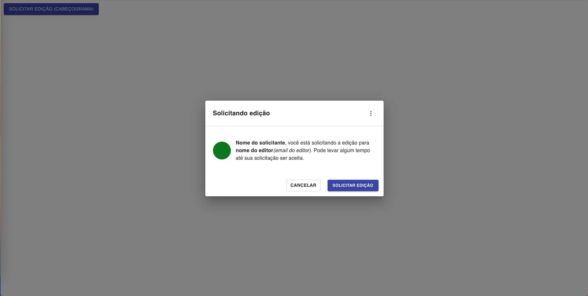
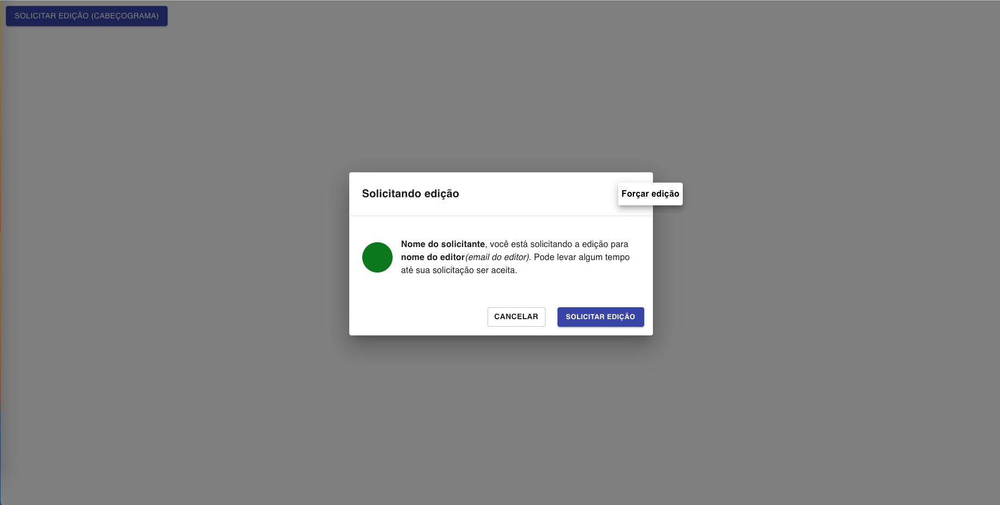
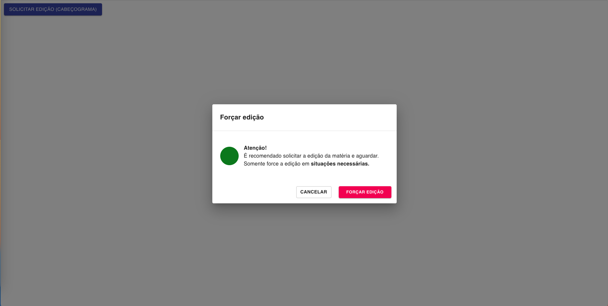

# Componente Modal com Mudança de Conteúdos

Esse projeto consiste na construção de um componente modal, que terá o seu título, conteúdo e botões de ação alterados depois que um botão é clicado.

## Para rodar a aplicação:

- cd concurrency-control/modal
- nvm use 18
- npm install --global yarn
- yarn start

## Layout:

